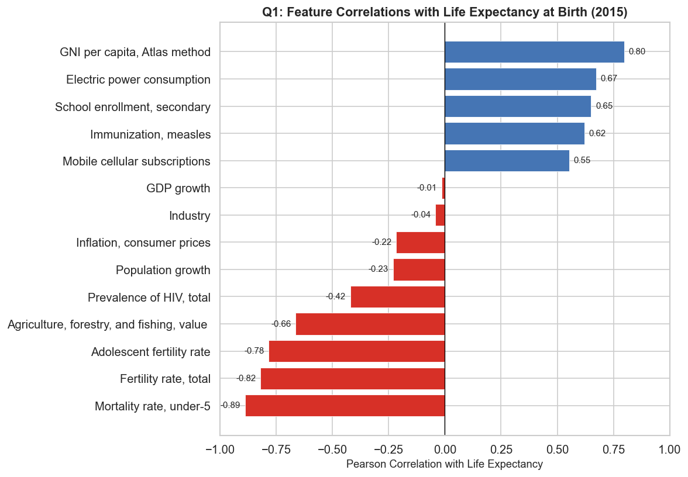
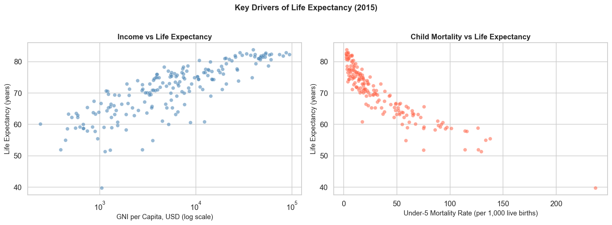
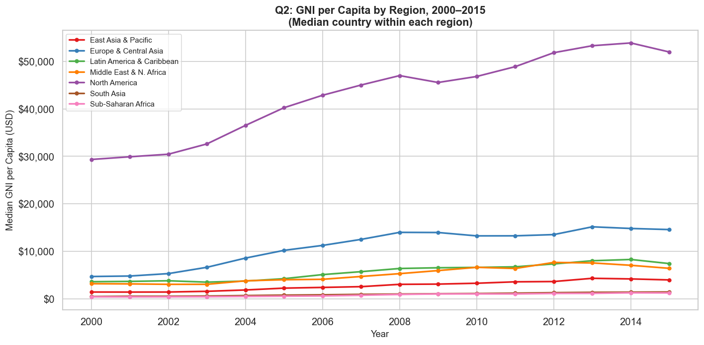
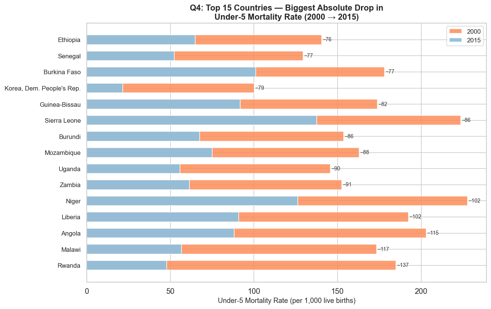
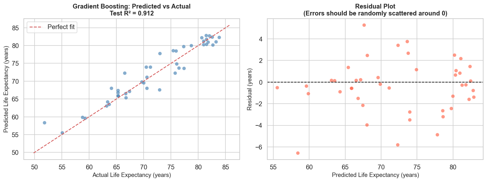
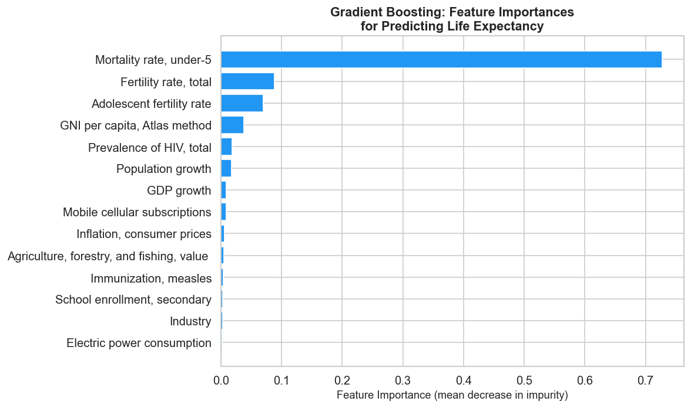
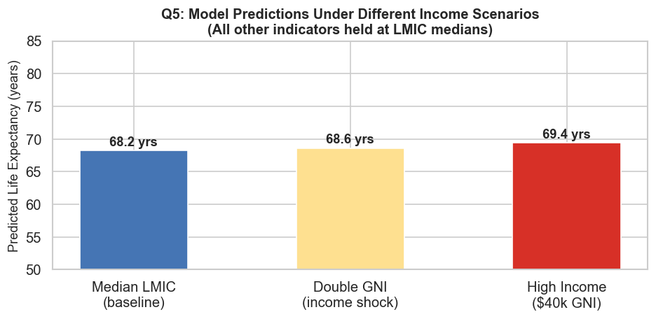

# What Determines How Long You'll Live? The Data Tells a Clear Story

*A data-driven look at 217 countries, 15 years, and the factors that predict life expectancy*

---

If you were born in Japan in 2015, you could expect to live to 83. If you were born in Sierra Leone that same year, your life expectancy was 51. That is a **32-year gap** — nearly an entire human generation — between two people born on the same day.

What explains differences like this? Using World Bank data covering 217 countries from 2000 to 2015, I set out to answer five questions about what truly drives life expectancy around the world.

---

## Questions of Interest

1. Which development indicators correlate most strongly with life expectancy?
2. How has national income (GNI per capita) grown across world regions since 2000?
3. Which countries improved child survival the most between 2000 and 2015?
4. Can a machine learning model predict a country's life expectancy from economic and health data?
5. What happens to predicted life expectancy if a developing country doubles its income?

---

## 1. The Strongest Predictors of Life Expectancy

Out of 14 economic and health indicators tested, these stand out the most:

**Negative correlates** — higher values mean shorter lives:
- **Under-5 child mortality rate** (−0.89) — the single strongest predictor
- **Fertility rate** (−0.82) — countries with more births per woman tend to have lower life expectancy
- **Adolescent fertility rate** (−0.78) — teen pregnancy is a strong marker of underdevelopment

**Positive correlates** — higher values mean longer lives:
- **GNI per capita** (+0.80) — wealthier nations live longer
- **Electric power consumption** (+0.67) — access to energy reflects broader infrastructure quality
- **Secondary school enrollment** (+0.65) — education is closely tied to health outcomes

The story is clear: countries where children survive, women have fewer pregnancies, and people have access to education and energy live significantly longer.

---

## 2. Which Regions Got Richer — and How Fast?

Between 2000 and 2015, income growth varied dramatically across the world.

- **East Asia & Pacific** showed the steepest rise, driven largely by China's economic expansion
- **Europe & Central Asia** and **North America** remained the wealthiest throughout
- **Sub-Saharan Africa** started lowest and grew the most slowly — though countries like Rwanda, Ethiopia, and Ghana showed strong individual growth
- **South Asia** made steady, consistent gains across the period

The absolute income gap between the richest and poorest regions *widened* over 15 years, even as percentage differences narrowed slightly — a reminder that growth alone does not close inequality.

---

## 3. The Quiet Heroism of Child Mortality Progress

The most encouraging finding in the entire dataset: child mortality improvements were dramatic, and they came from the world's poorest countries.

| Country | Rate in 2000 | Rate in 2015 | Drop |
|---------|-------------|-------------|------|
| Rwanda | 184.9 | 47.8 | −137 (74%) |
| Malawi | 173.3 | 56.7 | −117 (67%) |
| Angola | 203.0 | 88.2 | −115 (57%) |
| Liberia | 192.4 | 90.8 | −102 (53%) |
| Niger | 227.8 | 126.3 | −102 (45%) |

Rwanda's reduction of 137 deaths per 1,000 live births in just 15 years is one of the most remarkable public health achievements of the early 21st century — driven by expanded vaccination programs, community health workers, and malaria bed net distribution. These are low-cost interventions with enormous impact.

---

## 4. Can a Model Predict Life Expectancy?

Short answer: yes, remarkably well.

A Gradient Boosting machine learning model trained on 14 economic and health indicators predicts life expectancy with:

- **R² = 0.912** — explaining 91% of the variation in life expectancy across countries
- **Mean Absolute Error = 1.81 years** — predictions are typically within less than 2 years of reality

Three models were compared — the Gradient Boosting model won on every metric:

| Model | Test R² | Mean Absolute Error |
|-------|---------|-------------------|
| Ridge Regression | 0.881 | 2.08 years |
| Random Forest | 0.906 | 1.93 years |
| **Gradient Boosting** | **0.912** | **1.81 years** |

The feature importance chart confirms what the correlations suggested — **under-5 mortality rate alone accounts for 73% of the model's predictive power**, far outweighing income or any other single indicator.

---

## 5. Does Doubling a Country's Income Save Lives?

Here is the most surprising finding of the analysis.

Take a hypothetical country with median lower-middle-income characteristics — 57 real countries match this profile, including India, Indonesia, Nigeria, and the Philippines. The model predicts a life expectancy of **68.2 years** for this baseline.

Now ask: what if that country doubled its income per person overnight, keeping everything else the same?

The model predicts only **+0.4 years** of additional life expectancy from doubling income alone ($2,180 → $4,360 GNI per capita). Moving all the way to a high-income country profile ($40,000 GNI) adds about **10 years**.

**What does this tell us?** Income matters — but it is not the lever most people assume. The countries that extended life expectancy the most over 2000–2015 did not simply get richer. They made targeted investments in child health, vaccination, maternal care, and education. The data shows these factors predict life expectancy *independently of income* — meaning a country does not have to wait to become wealthy before saving lives.

---

## The Bottom Line

| Finding | Key Takeaway |
|---------|-------------|
| Strongest correlates | Under-5 mortality (−0.89) and GNI per capita (+0.80) dominate |
| Regional income trends | East Asia & Pacific grew fastest; Sub-Saharan Africa lowest but improving |
| Child mortality champions | Rwanda led globally — 74% reduction in 15 years |
| Model accuracy | 91.2% of life expectancy variance explained with just 14 indicators |
| Income scenario | Doubling income alone adds only +0.4 years; health investments multiply the effect |

Life expectancy is not destiny. It is policy.

---

*Full analysis, code, and visualizations are available on [GitHub](https://github.com/DokurOmkar/world-bank-life-expectancy).*

*Dataset: World Bank Databank, World Development Indicators (2000–2015).*
